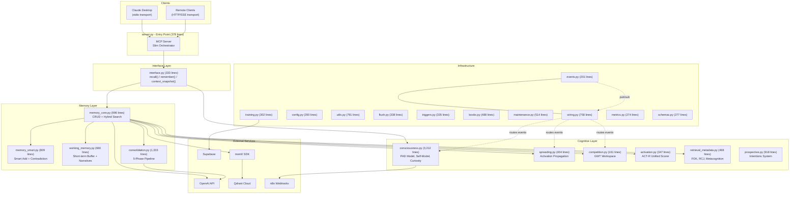
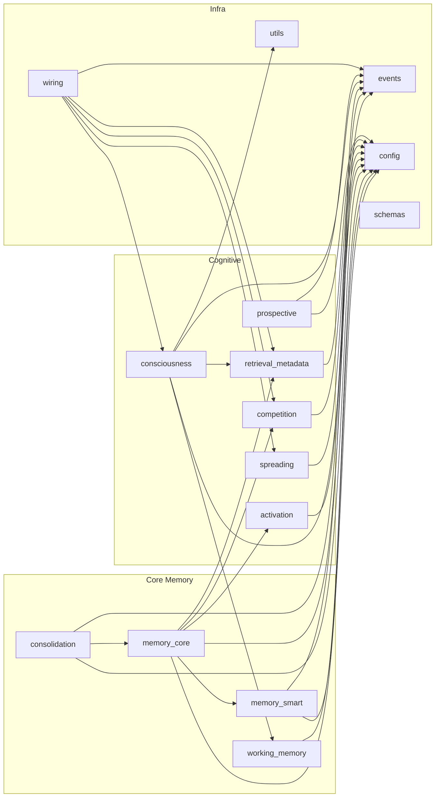
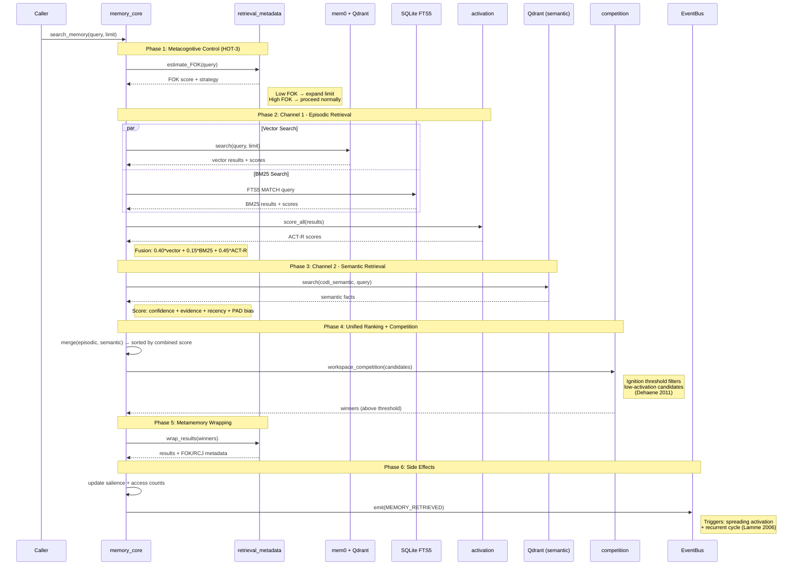
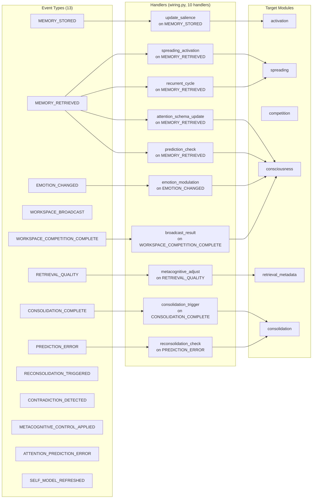
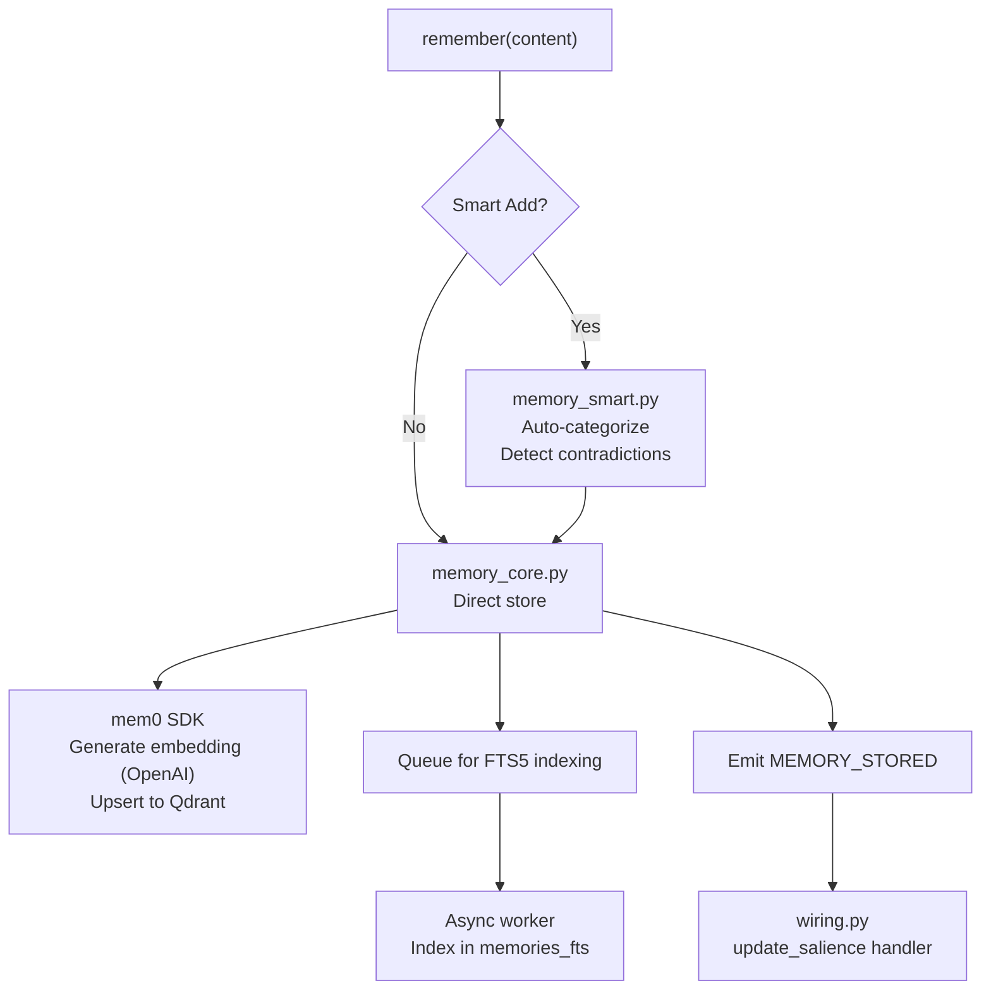
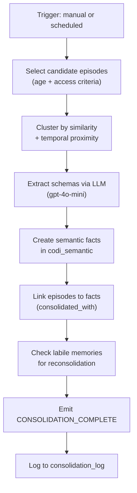
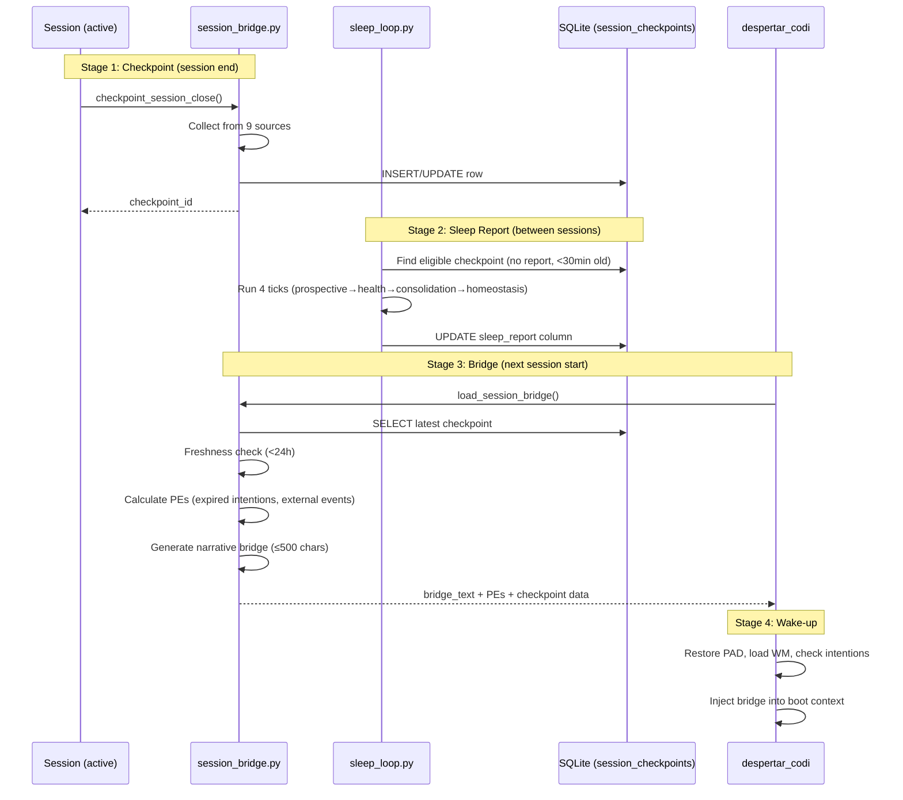
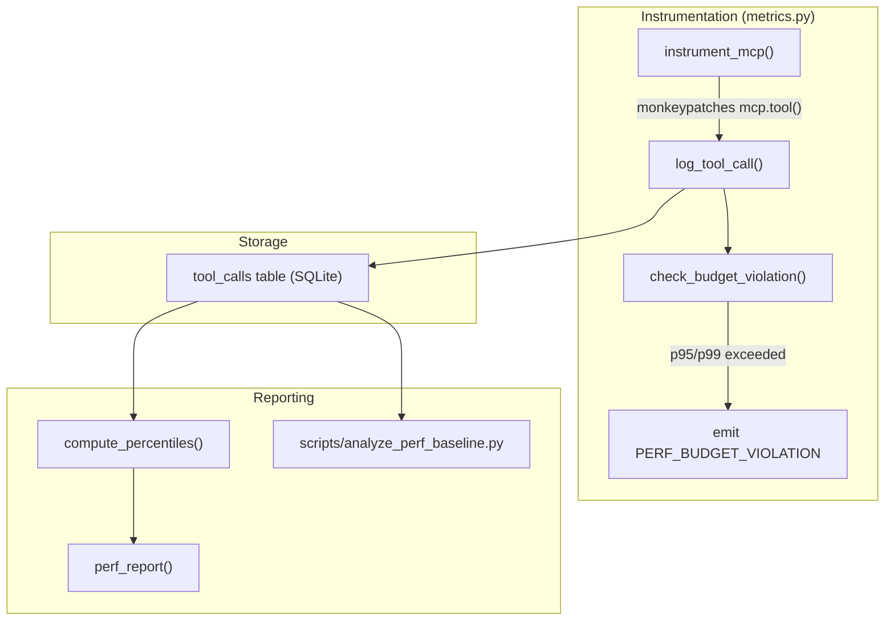

# Codi-Memory: Architecture Document

**System:** Neuroscience-Inspired Cognitive Memory for AI Agents
**Protocol:** MCP (Model Context Protocol) Server
**Codebase:** ~14,270 lines Python across 22 modules + 4,696 lines of tests (272 tests)
**Last Updated:** 2026-02-16

---

## Table of Contents

1. [System Overview](#1-system-overview)
2. [Module Architecture](#2-module-architecture)
3. [Storage Architecture](#3-storage-architecture)
4. [Search Pipeline](#4-search-pipeline)
5. [Event System and Wiring](#5-event-system-and-wiring)
6. [Cognitive Architecture Mapping](#6-cognitive-architecture-mapping)
7. [Consciousness Assessment](#7-consciousness-assessment)
8. [Data Flow](#8-data-flow)
9. [Deployment and Security](#9-deployment-and-security)
10. [Configuration](#10-configuration)
11. [Testing Strategy](#11-testing-strategy)
12. [Continuity Pipeline](#12-continuity-pipeline)
13. [Performance & SLO Model](#13-performance--slo-model)
14. [Sleep Loop Lifecycle](#14-sleep-loop-lifecycle)
15. [Trade-offs and Known Limitations](#15-trade-offs-and-known-limitations)

---

## 1. System Overview

Codi-Memory is an MCP server that provides persistent memory and cognitive capabilities to Claude. It implements a neuroscience-inspired architecture grounded in 13 published papers spanning Global Workspace Theory, Higher-Order Thought theory, Attention Schema Theory, Predictive Processing, and memory reconsolidation research.

The system exposes ~104 MCP tools organized around three macro-operations: `recall()`, `remember()`, and `context_snapshot()`. Internally, these route through 22 specialized modules that simulate episodic/semantic memory separation, metacognitive monitoring, spreading activation, workspace competition, and emotional modulation.



**Entry Point:** `server.py` (378 lines) is a slim orchestrator. It registers all MCP tools, initializes modules via lazy loading, and supports two transports:

| Transport | Use Case | Features |
|-----------|----------|----------|
| stdio | Claude Desktop (local) | Direct pipe, no auth |
| HTTP/SSE | Remote access | API key auth, rate limiting (60/min), 256KB body limit, `/health` endpoint |

---

## 2. Module Architecture

### 2.1 Module Dependency Graph



### 2.2 Module Catalog

#### Core Memory (4 modules)

| Module | Lines | Responsibility |
|--------|-------|---------------|
| `memory_core.py` | 996 | CRUD operations, hybrid search (vector + BM25 + ACT-R + semantic), metacognitive control loop, access tracking |
| `memory_smart.py` | 809 | Intelligent add with auto-categorization (decision/error/learning/pattern/personal/task), FTS5 indexing, async queue processing, inline contradiction detection at encoding time |
| `working_memory.py` | 660 | Short-term buffer (SQLite-backed), narrative chains and traces for linking related events, session-scoped |
| `consolidation.py` | 1,333 | 5-phase episodic-to-semantic pipeline, reconsolidation with prediction-error gating (Nader 2000), 3-channel contradiction detection (Kumaran & Maguire 2006) |

#### Cognitive Systems (6 modules)

| Module | Lines | Responsibility |
|--------|-------|---------------|
| `consciousness.py` | 3,212 | PAD emotional model (Pleasure-Arousal-Dominance), self-model maintenance, Butlin assessment (14 indicators), predict_context, curiosity generation, n8n webhook integration, `despertar_codi` boot sequence |
| `retrieval_metadata.py` | 468 | Feeling of Knowing (FOK) estimation, Retrospective Confidence Judgment (RCJ) calibration, metacognitive control: FOK score drives retrieval strategy adjustment (limit expansion) |
| `spreading.py` | 404 | Spreading activation via BFS traversal over related_memories graph, recurrent processing cycles (Lamme 2006) |
| `competition.py` | 161 | GWT workspace competition (Baars 1988), ignition threshold filtering (Dehaene 2011), coalition bonus for co-activated memories |
| `activation.py` | 347 | ACT-R unified scorer: `base_level + importance + emotion + spreading + noise`, differential decay rates per category |
| `schemas.py` | 277 | Pydantic validation models for structured data across modules |

#### Infrastructure (12 modules)

| Module | Lines | Responsibility |
|--------|-------|---------------|
| `events.py` | 201 | EventBus pub/sub, 13 event types, persistent counters in SQLite |
| `wiring.py` | 758 | 10 event handlers connecting modules (thalamocortical integration pattern), attention schema, prediction loop |
| `config.py` | 350 | 45+ parameters, lazy initialization for mem0/Qdrant/Supabase clients, Colombia timezone default |
| `interface.py` | 333 | 3 macro-tools abstracting ~104 underlying operations |
| `prospective.py` | 918 | Prospective memory: event-based and time-based intentions, tiered monitoring (active/background/dormant), power-law decay |
| `utils.py` | 791 | Ownership enrichment (source attribution + confidence), PAD retrieval bias, backup management, session state |
| `flush.py` | 338 | Checkpoints (per-event snapshots), session flush (end-of-session persist), Markdown export |
| `triggers.py` | 335 | Pattern-based triggers (19 configured), dynamic trigger creation at runtime |
| `books.py` | 488 | Knowledge books with chapters, cross-book connection discovery |
| `maintenance.py` | 514 | Scheduled maintenance tasks, external reminder management, system health checks |
| `training.py` | 302 | Training dataset capture for future fine-tuning, stored in Supabase |
| `metrics.py` | 274 | MCP tool instrumentation, usage frequency logging |

---

## 3. Storage Architecture

The system uses a polyglot persistence strategy: vectors for semantic similarity, full-text for keyword recall, structured tables for operational state, and JSON for lightweight config.

```mermaid
graph TB
    subgraph "Remote Storage"
        subgraph "Qdrant Cloud (Easypanel)"
            EP["codi_memories<br/>Episodic Memory<br/>1536-dim vectors"]
            SM["codi_semantic<br/>Semantic Facts<br/>1536-dim vectors"]
        end
        subgraph "Supabase"
            TE["codi_training_examples<br/>Fine-tuning Dataset"]
        end
        subgraph "OpenAI"
            EMB["text-embedding-3-small<br/>1536 dimensions"]
            LLM["gpt-4o-mini<br/>Consolidation LLM"]
        end
    end

    subgraph "Local Storage"
        subgraph "SQLite: memories_fts.db"
            FTS["memories_fts (FTS5)"]
            FQ["fts_queue"]
            CL["consolidation_log"]
            RL["reconsolidation_log"]
            LB["labile_memories"]
            WMT["working_memory"]
            NT["narrative_traces / trace_chains"]
            FS["failed_searches"]
            RB["retrieval_buffer"]
            RC["rcj_calibration"]
            TU["tool_usage"]
            EC["event_counts"]
        end
        subgraph "SQLite: prospective.db"
            INT["intentions"]
            IL["intention_log"]
        end
        subgraph "JSON Files"
            BK["memories_backup.json<br/>(rotating, max 20)"]
            TG["triggers.json<br/>(19 triggers)"]
            SS["data/session_state.json"]
            LB2["libros.json"]
            MN["mantenimiento.json"]
        end
    end

    MC[memory_core] --> EP & SM & FTS
    MS[memory_smart] --> FQ
    CS[consolidation] --> EP & SM & CL & RL & LB
    WM[working_memory] --> WMT & NT
    RM[retrieval_metadata] --> FS & RB & RC
    PR[prospective] --> INT & IL
    ME[metrics] --> TU
    EV[events] --> EC
    TN[training] --> TE
```



### 3.1 Qdrant Collections

**`codi_memories` (Episodic)**

Stores individual experiences with rich metadata. Each point carries a 1536-dimensional vector (OpenAI `text-embedding-3-small`) plus a payload:

| Field | Type | Purpose |
|-------|------|---------|
| `data` | string | Raw memory content |
| `category` | string | decision / error / learning / pattern / personal / task |
| `ownership_source` | string | Attribution (codi / harec / external) |
| `ownership_confidence` | float | Attribution confidence [0, 1] |
| `narrative_importance` | float | Story-arc weight |
| `created_at` | datetime | Encoding timestamp |
| `temporal_session_id` | string | Session grouping |
| `emotional_valence` | float | Positive/negative charge |
| `emotional_weight` | float | Emotional intensity |
| `attention_salience` | float | Current attention weight (decays) |
| `attention_access_count` | int | Retrieval frequency |
| `access_timestamps` | list | Retrieval history |
| `self_reference` | bool | Is this about the system itself |
| `narrative_themes` | list | Topic tags |
| `related_memories` | list | Graph edges for spreading activation |
| `consolidated_with` | list | Linked semantic facts |
| `pad_at_encoding` | dict | PAD state when memory was formed |

**`codi_semantic` (Semantic Facts)**

Stores distilled knowledge extracted during consolidation:

| Field | Type | Purpose |
|-------|------|---------|
| `fact` | string | The semantic fact |
| `topic` | string | Domain topic |
| `confidence` | float | Belief strength [0, 1] |
| `evidence_count` | int | Supporting episode count |
| `episode_ids` | list | Source episodes |
| `last_observed` | datetime | Most recent supporting evidence |

### 3.2 SQLite Tables

Two databases provide local, low-latency structured storage:

**`memories_fts.db`** (12 tables) - Core operational state. The `memories_fts` table uses SQLite FTS5 for BM25 scoring during hybrid search. The `fts_queue` enables async indexing so memory storage is non-blocking.

**`prospective.db`** (2 tables) - Isolated database for the intentions system, keeping prospective memory independent of core memory operations.

---

## 4. Search Pipeline

The search pipeline is the most architecturally complex subsystem. It implements a multi-channel retrieval strategy with metacognitive gating.



### 4.1 Fusion Weights

The episodic channel fuses three signals with empirically tuned weights:

```
episodic_score = 0.40 * vector_similarity + 0.15 * bm25_score + 0.45 * actr_activation
```

**Rationale:** ACT-R activation gets the highest weight because it encodes recency, frequency, importance, emotional charge, and spreading activation in a single score. Vector similarity captures semantic relevance. BM25 handles exact keyword matches that vector search may miss.

### 4.2 ACT-R Activation Formula

```
activation = base_level + importance_boost + emotion_boost + spreading_boost + noise

where:
  base_level    = ln(sum(t_i^(-d))) for each access time t_i, with differential decay d per category
  importance    = importance_weight * normalized_importance
  emotion       = emotion_weight * emotional_weight * sign(valence)
  spreading     = spreading_weight * spreading_activation_score
  noise         = gaussian(0, noise_scale)
```

---

## 5. Event System and Wiring

The event system implements a lightweight pub/sub bus (Global Workspace Theory broadcast). All cross-module communication flows through events, keeping modules decoupled.



### 5.1 Thalamocortical Integration Pattern

The `wiring.py` module acts as an event routing layer inspired by thalamocortical relay patterns: it receives raw events and routes them to the appropriate processing module. No module directly calls another module's event handlers; all cross-module communication is mediated through `wiring.py`.

### 5.2 Persistent Counters

Event counts are persisted to SQLite (`event_counts` table) across sessions. This is critical because the Butlin consciousness assessment requires runtime evidence of actual cognitive processing (not just code imports). A FULL score on any indicator requires persistent evidence that the mechanism has been exercised.

---

## 6. Cognitive Architecture Mapping

Each cognitive subsystem maps to published neuroscience research. This table provides traceability from theory to implementation.

| Theory | Key Papers | Module(s) | Implementation |
|--------|-----------|-----------|----------------|
| **Global Workspace Theory** | Baars 1988, Dehaene et al. 2011 | `events.py`, `competition.py`, `wiring.py` | EventBus = workspace broadcast. `competition.py` implements ignition threshold: only memories exceeding activation threshold enter conscious workspace. Coalition bonus for co-activated memories. |
| **Higher-Order Thought** | Rosenthal 2005, Nelson & Narens 1990 | `retrieval_metadata.py`, `consciousness.py` | FOK estimates retrieval likelihood before search. RCJ calibrates confidence after retrieval. Metacognitive control adjusts strategy based on FOK (HOT-3 level). Self-model tracks system's own cognitive state. |
| **Attention Schema Theory** | Graziano 2013 | `wiring.py`, `consciousness.py` | Attention schema maintains model of what the system is attending to, including predict_next_focus and suppressed-item tracking. |
| **Predictive Processing** | Clark 2013, Friston 2010 | `consciousness.py`, `wiring.py` | Schema prediction generates expectations. PREDICTION_ERROR events fire when reality diverges from prediction. Preturn hook adjusts predictions before next retrieval. |
| **Recurrent Processing** | Lamme 2006 | `spreading.py`, `wiring.py` | Recurrent cycles on retrieval: initial feedforward pass followed by recurrent sweeps that re-activate related memories, simulating recurrent cortical processing. |
| **Memory Reconsolidation** | Nader et al. 2000, Sevenster et al. 2013 | `consolidation.py` | When a retrieved memory generates prediction error, it enters a labile state (tracked in `labile_memories` table). During this window it can be updated (re-embedded via upsert). PE magnitude gates whether reconsolidation triggers. |
| **Contradiction Detection** | Kumaran & Maguire 2006 | `consolidation.py`, `memory_smart.py` | 3-channel detection modeled on hippocampal CA1: (1) keyword overlap, (2) topic similarity, (3) negation detection. Fires CONTRADICTION_DETECTED event when channels converge. |
| **Schema Theory** | Bartlett 1932 | `consolidation.py` | Schema extraction from episodic clusters. Schema matching scores new memories for congruence. Congruence bonus accelerates consolidation. |
| **Consciousness Assessment** | Butlin et al. 2023, Block 1995 | `consciousness.py` | 14 indicators across 5 theories. Block's distinction between phenomenal and access consciousness informs the DORMANT/NASCENT/FULL scoring scale. |

### 6.1 Consolidation Pipeline (5 Phases)

The consolidation system (`consolidation.py`, 1,333 lines) implements the episodic-to-semantic transformation:

```
Phase 1: Candidate Selection
  → Identify episodic memories eligible for consolidation (age, access frequency, cluster membership)

Phase 2: Cluster Analysis
  → Group related episodes by semantic similarity and temporal proximity

Phase 3: Schema Extraction
  → Use LLM (gpt-4o-mini) to extract generalizable facts from episode clusters

Phase 4: Semantic Fact Creation
  → Store extracted facts in codi_semantic collection with confidence and evidence links

Phase 5: Reconsolidation Check
  → Review labile memories, apply PE-gated updates, log reconsolidation events
```

---

## 7. Consciousness Assessment

The system implements Butlin et al. 2023's framework for assessing indicators of consciousness in AI systems. 14 indicators are evaluated across 5 theoretical families.

**Current Score: 11.2 / 14** (with accumulated runtime evidence in persistent counters). Fresh install / cold start: expected ~4-5 / 14 until the system accumulates event history and RCJ/reconsolidation records.

### 7.1 Scoring Scale (Block 1995)

| Score | Label | Criteria |
|-------|-------|----------|
| 0.0 | ABSENT | No implementation |
| 0.3 | DORMANT | Code exists but no runtime evidence |
| 0.5 | PARTIAL | Runs sometimes, weak/spotty evidence or not behaviorally tied |
| 0.7 | NASCENT | Clear runtime evidence but insufficient volume/stability |
| 1.0 | FULL | Persistent evidence proving active use + behavioral linkage |

FULL requires runtime evidence stored in persistent counters, not merely the existence of code. This prevents score inflation from dead code paths.

### 7.2 Indicator Coverage

| Theory | Indicators | What They Measure |
|--------|-----------|-------------------|
| GWT (Baars/Dehaene) | 4 | Competition, ignition/gating, broadcast, workspace capacity/limits |
| HOT / Metamemory (Nelson & Narens; + Rosenthal for HOT framing) | 4 | Monitoring (FOK/RCJ), control, self-model/reflective processes |
| AST (Graziano) | 1 | Attention schema (model of attention + prediction loop) |
| RPT (Lamme) | 2 | Recurrent processing loops + cross-module integration |
| PP (Clark/Friston) | 3 | Prediction, prediction error, model updating/reconsolidation link |

---

## 8. Data Flow

### 8.1 Memory Storage Flow



### 8.2 Consolidation Flow



### 8.3 Boot Sequence (despertar_codi)

```
1. Initialize config (lazy-load external clients)
2. Restore session state from JSON
3. Load persistent event counters from SQLite
4. Run Butlin assessment (14 indicators)
5. Set initial PAD emotional state
6. Check prospective memory for pending intentions
7. Run health check on external services
8. Emit boot-complete event
```

---

## 9. Deployment and Security

### 9.1 Transport Modes

| Mode | Transport | Auth | Rate Limit | Body Limit | Use Case |
|------|-----------|------|------------|------------|----------|
| Local | stdio | None (process-level) | None | None | Claude Desktop |
| Remote | HTTP/SSE | API key header | 60 req/min | 256 KB | Remote agents |

### 9.2 External Service Dependencies

| Service | Purpose | Failure Impact | Fallback |
|---------|---------|----------------|----------|
| OpenAI API | Embeddings + consolidation LLM | No new memories can be stored; no consolidation | BM25-only search still works |
| Qdrant Cloud | Vector storage | No vector search, no memory storage | FTS5 search continues; local backup available |
| Supabase | Training data storage | Training capture fails | Silently skipped; non-critical path |
| n8n | Webhook automation | No external notifications | Silently skipped; non-critical path |
| mem0 SDK | Memory management layer | No memory operations | Direct Qdrant client as potential fallback |

### 9.3 Data Protection

- **Backup:** `memories_backup.json` with rotating history (max 20 snapshots)
- **Restore:** `restore_memories()` rebuilds from backup if Qdrant data is lost
- **Session persistence:** `data/session_state.json` survives process restarts
- **Event counters:** Persisted in SQLite; survive restarts (critical for Butlin scoring)

---

## 10. Configuration

`config.py` (350 lines) centralizes 45+ parameters with lazy initialization. Key parameter groups:

| Group | Count | Examples |
|-------|-------|---------|
| Consolidation | 4 | min_age_hours, min_cluster_size, max_facts_per_run, llm_model |
| Reconsolidation | 4 | labile_window_minutes, pe_threshold, max_updates_per_memory, cooldown |
| Contradiction Detection | 4 | keyword_threshold, topic_threshold, negation_weight, channel_fusion |
| Decay | 8 | base_decay_rate, category-specific rates (decision, error, learning, etc.) |
| Spreading Activation | 6 | max_depth, decay_factor, min_activation, recurrent_cycles, fan_limit, boost |
| Working Memory | 1 | capacity (buffer size) |
| Prospective Memory | 5 | check_interval, active/background/dormant thresholds, power_law_exponent |
| Competition (GWT) | 4 | ignition_threshold, coalition_bonus, max_winners, competition_rounds |
| Importance Weights | 4 | base_level, importance, emotion, spreading (for ACT-R scorer) |

All parameters are module-level constants. No runtime configuration reload mechanism exists.

---

## 11. Testing Strategy

**272 tests across 11 files, ~4,696 lines of test code.**

### 11.1 Test Categories

| File | Tests | Purpose |
|------|-------|---------|
| `test_task_battery.py` | 12 | Behavioral tests across 6 cognitive mechanisms (end-to-end) |
| `test_task_battery_ablations.py` | 4 | Ablation tests proving each module's contribution (disable module, verify degradation) |
| `test_phase4.py` | varies | Phase 4 regression suite |
| `test_phase3_wave1.py` | varies | Phase 3 regression suite |
| `test_activation.py` | varies | ACT-R scorer unit tests |
| `test_metamemory.py` | varies | FOK/RCJ unit tests |
| `test_competition.py` | varies | GWT competition unit tests |
| `test_butlin.py` | varies | Consciousness assessment tests |
| `test_prediction_loop.py` | varies | Predictive processing tests |
| `test_prospective.py` | varies | Intentions system tests |
| `test_schemas.py` | varies | Pydantic validation tests |

### 11.2 Test Infrastructure

- **`conftest.py`**: SQLite isolation via `autouse` fixture (each test gets a fresh database), `clean_event_bus` fixture resets pub/sub state
- **`pytest.mark.battery`**: Marks behavioral battery tests for selective execution
- **Ablation methodology**: Disable a single module, run the same behavioral battery, assert measurable degradation. This proves each module contributes to system behavior rather than being dead code.

---

## 12. Continuity Pipeline

Cross-session continuity is achieved through a 4-stage pipeline: **checkpoint → sleep_report → bridge → despertar_codi**. The system does not persist continuity literally; it reconstructs it from structured snapshots and deterministic prediction errors, inspired by hippocampal replay and autobiographical memory.



### 12.1 Checkpoint Data (9 Sources)

`checkpoint_session_close()` captures minimal sufficient state from 9 sources in a single SQLite row:

| Source | Data | Purpose |
|--------|------|---------|
| Working memory | Top 15 items by relevance | What was active in short-term buffer |
| PAD emotional state | P/A/D values + trigger | Emotional context at session end |
| Pending intentions | Up to 10, with priority + activation + expiry | Prospective memory continuity |
| Goal stack | List of {goal, status, next_step} | Task continuity |
| Active project | Highest-relevance WM topic | Project context |
| Attention schema | Current focus + strength | What system was attending to |
| Prediction state | Last predicted topic + confidence | Predictive processing state |
| Recent prediction errors | Last 3 PEs | Surprise signals for bridge |
| Active narrative traces | Trace names + themes | Story-arc continuity |
| Decisions | Session param + WM decision items | Decision history |

### 12.2 Bridge Reconstruction

`load_session_bridge()` generates a deterministic narrative bridge (no LLM, no invention):

1. **Freshness gate**: Ignore checkpoints older than 24 hours
2. **PE calculation**: Two deterministic sources:
   - Expired intentions (expiry timestamp < now)
   - External events (recordatorios_externos.json newer than checkpoint)
3. **Narrative assembly**: Summary → project → time elapsed → PEs → sleep report → pending intentions → next step
4. **Cap at 500 chars** to prevent context bloat

### 12.3 Deduplication & Source Priority

- **Dedupe window**: 120 seconds. No new checkpoint if one exists within this window.
- **Source priority**: `flush` (score 2) > `hook` (score 1). A flush can upgrade a hook checkpoint within the dedupe window.
- **Retention**: Only the last 50 checkpoints are kept. Older rows are pruned on each write.

---

## 13. Performance & SLO Model

All MCP tools are automatically instrumented for latency, success/failure, and payload size. The system enforces performance contracts via budgets and emits violation events.

### 13.1 Instrumentation Architecture



**How it works:** `instrument_mcp(mcp)` monkeypatches `mcp.tool()` so every tool registration wraps the original function with timing logic. This means **all tools are instrumented without modifying any module**. The wrapper:

1. Records `started_at` timestamp
2. Measures `duration_ms` via `time.perf_counter()`
3. Captures `args_size` and `result_size` (approximate bytes, no content persisted)
4. Writes one row to `tool_calls` table per invocation
5. Checks against budget contract; emits `PERF_BUDGET_VIOLATION` event if exceeded

### 13.2 Performance Contracts

Six budget categories, defined in `config.py:PERF_CONTRACTS`:

| Category | p95 Budget | p99 Budget | Tools |
|----------|-----------|-----------|-------|
| macro | 2,000ms | 5,000ms | recall, remember, context_snapshot |
| search | 1,500ms | 3,000ms | search_memory, search_by_theme, search_by_ownership, search_by_emotion |
| write | 1,500ms | 3,000ms | add_memory, add_memory_smart |
| fast | 200ms | 500ms | get_emotional_state, get_working_memory, get_workspace_state, listar_triggers, audit_tools |
| consolidation | 5,000ms | 10,000ms | run_consolidation, dream_consolidation, consolidate_recent |
| default | 1,000ms | 3,000ms | everything else |

### 13.3 SLO Layers

The system defines three SLO layers (documented in `docs/SLO.md`):

**Layer 1 (Interactive):** Protects user experience. Violations here mean the system feels "frozen".

| Tool | p50 SLO | p95 SLO | p99 SLO |
|------|---------|---------|---------|
| despertar_codi | ≤ 4,000ms | ≤ 8,000ms | ≤ 15,000ms |
| recall | ≤ 3,000ms | ≤ 7,000ms | ≤ 12,000ms |
| search_memory | ≤ 2,500ms | ≤ 5,000ms | ≤ 8,000ms |
| Fast tools (WM, triggers) | ≤ 50ms | ≤ 200ms | ≤ 500ms |

**Layer 2 (Write-path):** Current synchronous pipeline (mem0 → OpenAI → Qdrant) cannot meet interactive SLOs. Target architecture: async ACK (respond in <2s, process in background).

**Layer 3 (Sleep Loop):** Budget enforcement per tick. See [Section 14](#14-sleep-loop-lifecycle).

### 13.4 Measurement

- **Automated**: All tool calls logged to `tool_calls` table via `instrument_mcp()` wrapper
- **Quick check**: `perf_report_tool(days=7)` MCP tool
- **Full analysis**: `python scripts/analyze_perf_baseline.py --days 30 --json`
- **Baseline**: `docs/perf/baseline_2026-02-16.md` (413 calls, 8 days of data)

---

## 14. Sleep Loop Lifecycle

The sleep loop (`modules/sleep_loop.py`) is a background process that runs between sessions to perform memory maintenance. It is triggered every 30 minutes via macOS launchd.

### 14.1 Execution Model

```
launchd (every 30 min)
  └── python -m modules.sleep_loop --reason=launchd
       ├── Pre-checks: DB exists? Eligible checkpoint? Lock available?
       ├── Acquire PID-based lock file (data/sleep_loop.lock)
       ├── run_sleep_loop(budget_ms=8000)
       │    ├── Tick 1: prospective (intention maintenance)
       │    ├── Tick 2: health (FTS queue + health check)
       │    ├── Tick 3: consolidation (light, no LLM)
       │    └── Tick 4: homeostasis (salience decay + PAD decay)
       ├── Write sleep_report to checkpoint row (idempotent)
       └── Release lock
```

### 14.2 Tick Ordering Contract

Ticks execute in fixed order: `prospective → health → consolidation → homeostasis`

**Rationale:** Fast ticks first, heavy ticks last. If budget exhaustion occurs, it starves homeostasis (least critical), not prospective (most time-sensitive).

| Tick | Min Budget | What It Does | Neuroscience Basis |
|------|-----------|-------------|-------------------|
| prospective | 200ms | `apply_intention_maintenance()` - decay activation, check deadlines | McDaniel & Einstein 2007 |
| health | 200ms | FTS queue processing (up to 50 items) + `_verificar_salud_memoria_interna()` | System health |
| consolidation | 1,500ms | `run_consolidation(scope="light")` - clustering only, no LLM calls | Diekelmann & Born 2010 |
| homeostasis | 200ms | `apply_salience_decay(0.05)` + `apply_emotional_decay()` (PAD → baseline) | Tononi & Cirelli 2003 |

### 14.3 Budget Gating

Each tick is gated by remaining time budget:

```
for tick in TICK_ORDER:
    remaining_ms = budget_ms - elapsed_so_far
    if remaining_ms < TICK_MIN_MS[tick]:
        → skip tick (log status="skipped", reason="budget_exhausted")
    else:
        → execute tick
        → if elapsed > remaining: log status="over_budget"
        → else: log status="ok"
```

### 14.4 Tick-Level Metrics (E2.2)

Each tick writes one row to `tool_calls` with `tool_name=sleep_tick_{name}` and a tag encoding status:

| Tag Pattern | Meaning |
|------------|---------|
| `sleep_tick:ok` | Tick completed within budget |
| `sleep_tick:over_budget` | Tick ran but exceeded remaining allocation |
| `sleep_tick:skipped:budget_exhausted` | Tick was not attempted due to insufficient budget |
| `sleep_tick:error:{ExceptionType}` | Tick threw an unhandled exception |

Query: `SELECT * FROM tool_calls WHERE tool_name LIKE 'sleep_tick_%'`

### 14.5 Safety Mechanisms

- **PID lock file**: `data/sleep_loop.lock` prevents concurrent execution. Stale locks (dead PID) are automatically cleaned.
- **Idempotent writes**: `_write_sleep_report()` only writes if `sleep_report IS NULL OR sleep_report = ''`. Never clobbers an existing report.
- **Eligible checkpoint gate**: Only runs if the latest checkpoint is < 30 minutes old and has no report.
- **Budget cap**: Total loop capped at 8,000ms (configurable via `--budget-ms`).
- **Report cap**: Sleep report text capped at 600 characters.

### 14.6 SLOs

| Metric | Target |
|--------|--------|
| Total run time | ≤ 8,000ms |
| prospective tick p95 | ≤ 1,000ms |
| health tick p95 | ≤ 2,000ms |
| consolidation tick p95 | ≤ 4,000ms |
| homeostasis tick p95 | ≤ 3,000ms |
| Tick skip rate | < 10% of runs |
| Run success rate | ≥ 95% |

---

## 15. Trade-offs and Known Limitations

### 15.1 Architectural Trade-offs

| Decision | Benefit | Cost |
|----------|---------|------|
| **mem0 as abstraction over Qdrant** | Simplified memory management, built-in deduplication | Extra dependency, less control over embedding/indexing, potential version lock-in |
| **Single-process architecture** | Simple deployment, no IPC overhead, atomic operations | Vertical scaling only; CPU-bound consolidation blocks other operations |
| **SQLite for operational state** | Zero-config, embedded, fast reads, transactional | No concurrent write scaling; single-writer lock under load |
| **OpenAI for all embeddings** | Consistent vector space, high quality | Vendor lock-in, latency on every store/search, cost scales linearly |
| **gpt-4o-mini for consolidation** | Cost-effective for summarization tasks | Quality ceiling on complex schema extraction; no local fallback |
| **Lazy initialization** | Fast startup, resources allocated on demand | First-use latency spike; harder to detect configuration errors at boot |
| **JSON files for config state** | Human-readable, easy manual editing | No schema validation on disk, no atomic writes, corruption risk on crash |
| **Monolithic server.py** | All tools in one process, shared state | Cannot scale individual subsystems independently |

### 15.2 Known Limitations

1. **No horizontal scaling.** The system is single-process. Qdrant and Supabase are remote, but SQLite is local and single-writer. Running multiple instances would cause SQLite lock contention and split-brain on local state.

2. **Embedding vendor lock-in.** All vectors are 1536-dimensional OpenAI `text-embedding-3-small`. Switching embedding models requires re-embedding the entire corpus and recalibrating fusion weights.

3. **No vector garbage collection.** Deleted or superseded memories may leave orphan vectors in Qdrant. The backup/restore cycle does not prune orphans.

4. **Consolidation is synchronous and LLM-dependent.** A consolidation run makes multiple OpenAI API calls. If the API is slow or rate-limited, consolidation blocks. No local LLM fallback exists.

5. **FTS5 index can drift from Qdrant.** The async FTS5 indexing queue means there is a window where a memory exists in Qdrant but is not yet searchable via BM25. Queue failures could cause permanent drift.

6. **No formal schema migration system.** SQLite schema changes are applied in code at startup. There is no migration versioning, rollback capability, or schema version tracking.

7. **Event handler failures are silent.** If a `wiring.py` handler throws, the exception is caught and logged but does not propagate. This prevents cascade failures but can hide bugs.

8. **PAD model has no external calibration.** The Pleasure-Arousal-Dominance emotional state is self-reported and self-adjusted. There is no external ground truth or calibration mechanism.

9. **Butlin assessment is self-evaluated.** The system scores its own consciousness indicators. There is no external auditor or adversarial probe.

10. **No request tracing.** Individual MCP tool calls are instrumented in `metrics.py`, but there is no distributed trace ID linking a `recall()` call through the full pipeline (metacognition, search, competition, side effects).

### 15.3 Scaling Considerations

For 10x growth in memory corpus:

- **Qdrant** scales horizontally (sharding) -- no architectural change needed
- **SQLite FTS5** will degrade; consider migrating to a dedicated search service (Meilisearch, Typesense)
- **ACT-R scoring** iterates all candidates -- O(n) per search; may need pre-computation or caching
- **Spreading activation BFS** is bounded by `max_depth` and `fan_limit` configs, but dense graphs could still be expensive
- **Consolidation** runtime scales with corpus size; consider incremental/streaming consolidation

---

## Appendix A: File Index

```
codi-memory/
  server.py                          (378 lines)  Entry point
  modules/
    memory_core.py                   (996 lines)  CRUD + hybrid search
    memory_smart.py                  (809 lines)  Smart add + contradiction
    working_memory.py                (660 lines)  Short-term buffer
    consolidation.py               (1,333 lines)  5-phase pipeline
    consciousness.py               (3,212 lines)  PAD + self-model + assessment
    retrieval_metadata.py            (468 lines)  FOK + RCJ + metacognition
    spreading.py                     (404 lines)  Spreading activation
    competition.py                   (161 lines)  GWT workspace
    activation.py                    (347 lines)  ACT-R scorer
    schemas.py                       (277 lines)  Pydantic models
    events.py                        (201 lines)  EventBus
    wiring.py                        (758 lines)  10 event handlers
    config.py                        (350 lines)  Configuration
    interface.py                     (333 lines)  3 macro-tools
    prospective.py                   (918 lines)  Intentions
    utils.py                         (791 lines)  Utilities
    flush.py                         (338 lines)  Checkpoints + export
    triggers.py                      (335 lines)  Pattern triggers
    books.py                         (488 lines)  Knowledge books
    maintenance.py                   (514 lines)  Health + scheduling
    training.py                      (302 lines)  Training dataset
    metrics.py                       (274 lines)  Instrumentation
  tests/
    conftest.py                                   Test infrastructure
    test_task_battery.py                          Behavioral battery (12 tests)
    test_task_battery_ablations.py                Ablation tests (4 tests)
    test_phase4.py                                Phase 4 regression
    test_phase3_wave1.py                          Phase 3 regression
    test_activation.py                            ACT-R tests
    test_metamemory.py                            FOK/RCJ tests
    test_competition.py                           GWT tests
    test_butlin.py                                Assessment tests
    test_prediction_loop.py                       PP tests
    test_prospective.py                           Intentions tests
    test_schemas.py                               Validation tests
```

## Appendix B: External Dependencies

| Package | Version Constraint | Purpose |
|---------|-------------------|---------|
| `mcp` | SDK | MCP protocol server |
| `mem0ai` | - | Memory management over Qdrant |
| `qdrant-client` | - | Direct Qdrant access (semantic collection) |
| `openai` | - | Embeddings + LLM |
| `supabase` | - | Training data storage |
| `pydantic` | - | Data validation |
| `uvicorn` | - | HTTP/SSE server |
| `httpx` | - | n8n webhook calls |

## Appendix C: Neuroscience Paper References

1. Baars, B.J. (1988). *A Cognitive Theory of Consciousness.* Cambridge University Press.
2. Dehaene, S., & Changeux, J.P. (2011). Experimental and theoretical approaches to conscious processing. *Neuron*, 70(2), 200-227.
3. Rosenthal, D.M. (2005). *Consciousness and Mind.* Oxford University Press.
4. Nelson, T.O., & Narens, L. (1990). Metamemory: A theoretical framework and new findings. *Psychology of Learning and Motivation*, 26, 125-173.
5. Graziano, M.S.A. (2013). *Consciousness and the Social Brain.* Oxford University Press.
6. Clark, A. (2013). Whatever next? Predictive brains, situated agents, and the future of cognitive science. *Behavioral and Brain Sciences*, 36(3), 181-204.
7. Friston, K. (2010). The free-energy principle: a unified brain theory? *Nature Reviews Neuroscience*, 11(2), 127-138.
8. Lamme, V.A.F. (2006). Towards a true neural stance on consciousness. *Trends in Cognitive Sciences*, 10(11), 494-501.
9. Nader, K., Schafe, G.E., & Le Doux, J.E. (2000). Fear memories require protein synthesis in the amygdala for reconsolidation after retrieval. *Nature*, 406, 722-726.
10. Sevenster, D., Beckers, T., & Kindt, M. (2013). Prediction error governs pharmacologically induced amnesia for learned fear. *Science*, 339(6121), 830-833.
11. Kumaran, D., & Maguire, E.A. (2006). An unexpected sequence of events: mismatch detection in the human hippocampus. *PLoS Biology*, 4(12), e424.
12. Bartlett, F.C. (1932). *Remembering: A Study in Experimental and Social Psychology.* Cambridge University Press.
13. Butlin, P., et al. (2023). Consciousness in Artificial Intelligence: Insights from the Science of Consciousness. *arXiv:2308.08708*.
14. Block, N. (1995). On a confusion about a function of consciousness. *Behavioral and Brain Sciences*, 18(2), 227-247.
